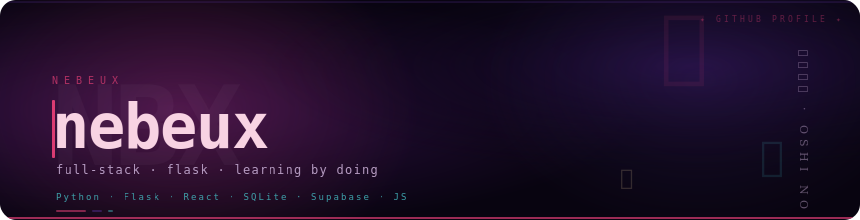

<div align="center">



<br/>

*「 この芸能界において、嘘は武器だ 」*
<br/>
<sub>In the world of entertainment, lies are weapons. — 【推しの子】</sub>

<br/>

[](##-tech-stack)
[](##-hackathons)
[](##-github-stats)
[](https://github.com/nebeux)

</div>

<br/>

## 🧰 Tech Stack

<div align="center">


<br/><br/>


<sub>also: SQLAlchemy · SQL · CapCut · Canva · always adding more ✦</sub>

</div>

<br/>

## 🏆 Hackathons & Achievements

```
✦ 2nd Place — SMathHacks .................. 🥈 top 2
✦ 4 hackathons competed & shipped .......... 💻 and counting
✦ Builds everything from scratch ........... 🔧 flask lover
✦ Always picking up new tech ............... ⚡ every leap year... ;)
```

<br/>

## 📊 GitHub Stats

<div align="center">


<br/>


</div>

<br/>

## ⚡ About Me

```python
nebeux = {
    "status":     "full-time coder & highschooler",
    "watching":   "none rn",
    "exploring":  ["advanced Python", "React projects", "Flask APIs"],
    "arch_enemy": "TypeError",
    "philosophy": "learning by creating > everything else",
}
```

<br/>

## 📫 Connect

<div align="center">

[](https://github.com/nebeux)

</div>
